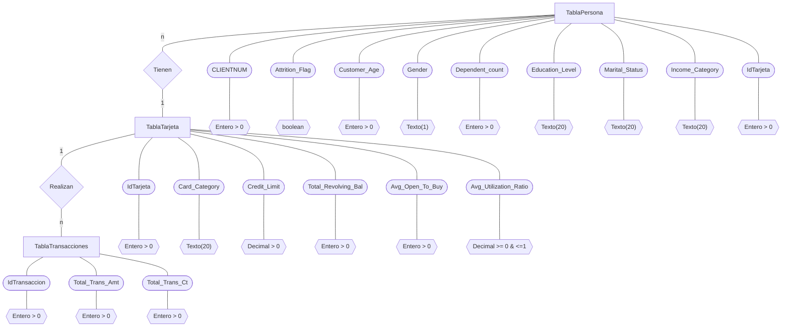

# Tarea 2: Modelo Entidad Relación

## BD. Predicción de la segmentación de clientes de tarjetas de crédito

## Recursos.

### 
[Mermaid](https://mermaid.live/edit#pako:eNp9lG1P4kAUhf9KMx82NUHTaddSyLoJbyoGX6nGbGuaoR3rmHaGLVNWLfz3nbnQCIr2C2XOfe6ZOXOhQrFIKGqjx0z8i59IIQ2_H3JDPTjwySQjV7SYCU4e1ovG_v6-0TGD3mg4uPAvbs8f9lZKBxRSVQMuaSGM34a1XG5CXTPoSFkwyQSPjjOS1mQX5ElVTYTIKOHbWE95lTMpclpEnZTWUA_E-Gu7vhmcUJ7Qoib6sJxUVYh8-iKFifdCtM0MzKBPp5riMopFyWUND0CnX9sdm8EgKWMCpxvROc1q9Bj0x3df2_pkfGIG50RFQ7JoLIksZzV8AnL6LXxqBkMeq4CiHpE0FcVrTZ-C_vQtPVR04pPimUpSc0NQ2K7ThjzkWKkLvsC48hnllCsJQ7MFXtght1eDU_dUC0oafvQZrk0-uejqM3XppEi2DnQG9c87DqOJS0UUNGEyGrGcwb1dAiCqqk9jlpNs0-DKDHyh476hc5HNGU-jLoEruwJqumtX12qC52l0qSYk8kXULWFf1wD83QXcrYBbyTL2thqNG_2hsTvA5hu7OzIs44fx6whrfNVAB2pXN5RoXuds28YqfCfkzjrngvAZiWPVnc5U2o4quIew3wVteA-GLx_3qcvHdRqARJ0c8hsDMNsF-NtAD-p9qJfb9aiB1C83JyxRfzKVnqEQySea0xC11WtCH0mZyRCFXJeSUorxK49RWxYlbaBymqgJ6DOSFiSvF6eE_xFi8ytqV-gFtR3roOm6Tcs5bB16GNtNu4FeURtb9sFPbLlO07Ncz2t5eNlAb9DBOmh5TtNttVzLcbHdcr3lf0YBjmI)