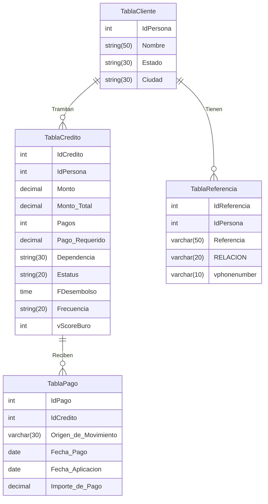

# **Tarea 3 : Modelo Relacional y Operaciones de Álgebra Relacional.**

## **Parte 1: Esquema del modelo relacional**

1. TablaCliente(**IdPersona**, Nombre, Estado, Ciudad)
2. TablaCredito(**IdCredito**, _IdPersona_,Monto, Monto_Total, Pagos, Pago_Requerido, Dependencia, Estatus , Sucursal, FDesembolso, Frecuencia, vScoreBuro)
3. TablaPago(**IdPago**, _IdCredito_, Origen_de_Movimiento, Fecha_Pago, Fecha_Aplicación, Importe_de_Pago)
4. TablaReferencia(**IdReferencia**, _IdPersona_, Referencia, RELACION, vphonenumber)

## **Parte 2: Diagrama relacional**

## **Parte 3: Álgebra Relacional**
**1.Obtener el nombre de los clientes del Estado Nuevo Leon**

$ \prod Nombre\left ( \sigma Estado = "Nuevo Leon" \left ( TablaCliente \right ) \right )$

**2.Obtener los creditos los cuales fueron originados a partir de la fecha escogida**

$ \prod Credito\left ( \sigma FDesembolso > XX/XX/XXXX \left ( TablaCredito\right ) \right )$

**3.Obtener el nombre de las personas con creditos con un monto otorgado mayor a 50,000**

$\prod TablaNombre.Nombre\left ( \sigma TablaCredito.Monto> 50000 \right )$

**4.Obtener el nombre de las personas con creditos con Estatus Castigado**

$\prod TablaNombre.Nombre\left ( \sigma TablaCredito.Estatus = "Castigado" \right )$

## Recursos.

[Mermaid](https://mermaid.live/edit#pako:eNqFVF2PojAU_SukTzuJGkGBlbcZHROTnY84Pm1IzIVetQlt2VLMzjL-920Vd-rgxj7BOffznEJDckmRJATVjMFWAU-FZ84KsgKmBUOh0fv46Pdl02IKKdMyWZlQpkG44SeqOUH2MKG9BW3xr_ArqkoK-IQp5oxD4T1J4UZfwOuV1FBclnqFray68RZeL_FXjYpRp16lFRPbb6PhnTfDEgVFkTPo8IHhHysNunZqa8bRm8-wQp7JopJXs-YK8_pLUTvn_i2XCh9qZdJOzMGVubkpUNsjND2eJc8UXl3KDv2ffaespkDb3l3nXJ-tel7iLY2YGbouW6I7qgFv2r4Hle9AHSd5UWyLYk1x_ST3jFsBXMvB3Lo5muj1ZWWHuC8LlkPOpOhav-ClVBpt-eMep3Nl7ysXfIkbVEf3zPorw19s77AdET65m06epbBWXks78_Y6LR9_3E8XL89d1jfsvtxJM2LNM1T_FiQ9wlFxYNR82cc5U6J3yDEliXmkuIG60ClJxcGEQq3l27vISaJVjT1Sl1bm9ndAkg0UlUFLED-l5Ocg80qShvwmSRAM4iiaBFE4HMe-Pxr1yDtJ-sHYHwzjOI7i4fdwPAkmwaFH_hwr-INwFITxyGSEfuCPx9HhL5A7YMo)
