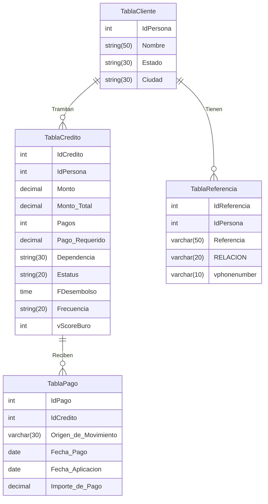

# **Tarea 3**

## **Parte 1: Esquema del modelo relacional**

1. TablaCliente(**IdPersona**, Nombre, Estado, Ciudad)
2. TablaCredito(**IdCredito**, _IdPersona_,Monto, Monto_Total, Pagos, Pago_Requerido, Dependencia, Estatus , Sucursal, FDesembolso, Frecuencia, vScoreBuro)
3. TablaPago(**IdPago**, _IdCredito_, Origen_de_Movimiento, Fecha_Pago, Fecha_Aplicación, Importe_de_Pago)
4. TablaReferencia(**IdReferencia**, _IdPersona_, Referencia, RELACION, vphonenumber)

## **Parte 2: Diagrama relacional**

## **Parte 3: Álgebra Relacional**